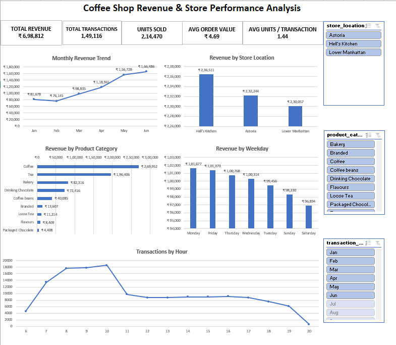

# Coffee Shop Revenue & Store Performance Analysis

## Overview

This project analyzes transaction-level coffee shop sales data using Microsoft Excel. The analysis focuses on revenue trends, store performance, product category contribution, weekday performance, time-period sales patterns, and hourly transaction activity.

An interactive Excel dashboard was created to help a Regional Operations Manager monitor key performance indicators and explore performance across store locations, product categories, and time periods.

## Business Problem

A multi-location coffee shop business needs a clear view of sales performance across time, store locations, and product categories to identify revenue drivers, peak operating periods, and opportunities for better operational and product decisions.

## Objectives

- Analyze overall revenue and transaction performance.
- Track monthly revenue trends.
- Compare revenue across store locations.
- Identify the highest-performing product categories.
- Analyze weekday sales performance.
- Identify peak revenue periods and transaction hours.
- Build an interactive Excel dashboard for business performance monitoring.

## Dataset

The project uses the Coffee Shop Sales dataset from Maven Analytics Data Playground.

The dataset contains 149,116 transaction records covering:

- Transaction date and time
- Transaction quantity
- Store location
- Product category
- Product type and detail
- Unit price

## Tools Used

- Microsoft Excel
- Excel Tables
- Excel Formulas
- PivotTables
- PivotCharts
- Slicers
- Timeline Filter
- Conditional and number formatting
- GitHub

## Excel Skills Demonstrated

- Data quality validation
- Duplicate checking
- Missing-value checking
- Date and time analysis
- Structured table references
- Calculated columns
- PivotTables
- PivotCharts
- KPI reporting
- Trend analysis
- Interactive slicers
- Timeline filtering
- Dashboard design
- Business insight generation

## Data Cleaning and Preparation

The dataset was validated before analysis.

Key preparation steps included:

- Checked for exact duplicate records; no duplicates were found.
- Checked for blank cells; no missing values were identified.
- Verified date, time, quantity, and price data types.
- Converted the working dataset into a structured Excel Table.
- Created a Revenue calculated field using transaction quantity and unit price.
- Created Month, Weekday, Hour, and Time Period fields for time-based analysis.

## Analysis Performed

The project analyzed:

- Monthly revenue trends
- Revenue by store location
- Revenue by product category
- Revenue by weekday
- Revenue by time period
- Transactions by hour
- Total revenue
- Total transactions
- Units sold
- Average order value
- Average units per transaction

## Dashboard Features

The Excel dashboard includes:

- 5 KPI cards
- Monthly Revenue Trend
- Revenue by Store Location
- Revenue by Product Category
- Revenue by Weekday
- Transactions by Hour
- Store Location slicer
- Product Category slicer
- Transaction Date timeline filter

## Key Insights

- Total revenue reached ₹698,812.33 from 149,116 transactions and 214,470 units sold.
- Revenue increased from ₹81,678 in January to ₹166,486 in June, despite a slight decline in February.
- Hell's Kitchen generated the highest store revenue at approximately ₹236,511.
- Coffee was the highest revenue-generating product category at approximately ₹269,952, followed by Tea at ₹196,406.
- Weekday revenue was relatively balanced, with Monday generating the highest revenue and Saturday the lowest.
- Morning was the strongest revenue period, generating approximately ₹220,162.
- Transaction activity peaked at 10 AM with 18,545 transactions.
- Average order value was ₹4.69, while average units per transaction were 1.44.

## Business Recommendations

- Prioritize staffing and service readiness during the 8–10 AM peak transaction window.
- Maintain strong inventory availability for Coffee and Tea products due to their high revenue contribution.
- Review successful operating and product-mix practices at Hell's Kitchen for potential application across other locations.
- Use targeted promotions or product bundles during lower-activity evening periods.
- Investigate the drivers behind the strong revenue growth from March through June to support future sales planning.

## Repository Structure

- `Coffee_Shop_Revenue_Store_Performance_Analysis.xlsb` — Interactive Excel analysis workbook and dashboard
- `Coffee_Shop_Dashboard.png` — Dashboard preview
- `README.md` — Project documentation

## How to Use the Workbook

1. Download the Excel workbook.
2. Open it in Microsoft Excel.
3. Navigate to the Dashboard worksheet.
4. Use the Store Location and Product Category slicers to filter the analysis.
5. Use the date timeline to explore performance across different months.
6. Review the Insights worksheet for key findings and recommendations.

## Dashboard Preview

## Conclusion

This project demonstrates practical Microsoft Excel skills through transaction-level data validation, business analysis, KPI reporting, PivotTables, PivotCharts, interactive filtering, dashboard design, and evidence-based business recommendations.
